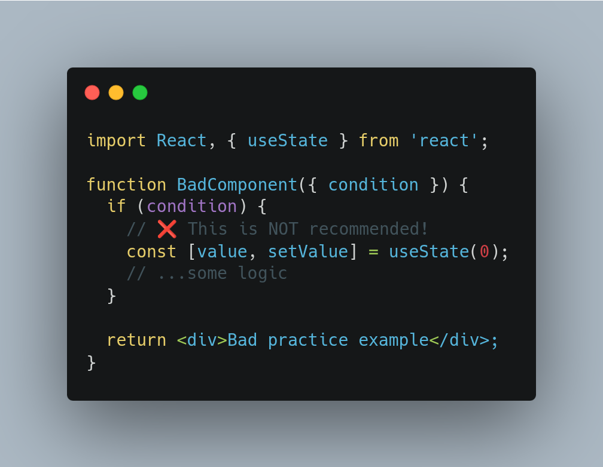
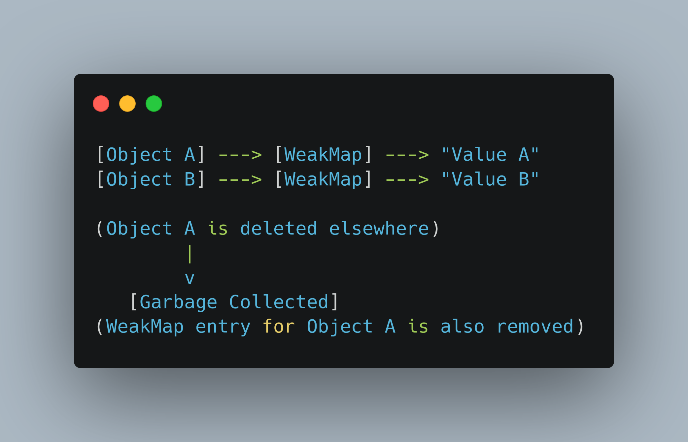

# 💡 Why Public Tinkering

I share my technical learning publicly to deepen my understanding, help others, and connect with the community. Public learning invites feedback, collaboration, and faster growth for everyone involved.

### Designing 


### In React props object are passed as a reference not a value

If the parent mutates an object prop in place, the child sees the change, but React may not re-render if the object reference didn’t change.

That’s why the recommended pattern is to treat props/state as immutable and always create a new object/array when updating, so React sees a new reference and re-renders.

### The Richardson Maturity Model

Simple way to describe how “RESTful” an API really is. It defines four levels (0–3), where each level adds more usage of HTTP semantics and REST principles.

Level 0 – “Swamp of POX”
Everything goes through a single endpoint, usually one HTTP method (often POST). HTTP is used only as a transport tunnel, and the real action is described in the request body.

Level 1 – Resources
The API starts exposing multiple endpoints representing resources, like /users or /orders/123. However, it may still overuse a single HTTP method and not leverage HTTP fully.

Level 2 – HTTP Verbs & Status Codes
Resources are combined with proper use of HTTP methods: GET for reading, POST for creating, PUT/PATCH for updating, DELETE for removing, plus meaningful status codes. This is where most practical “REST APIs” end up.

Level 3 – Hypermedia (HATEOAS)
On top of Level 2, responses include links and hypermedia controls that tell the client what it can do next. The client discovers navigation and actions dynamically, similar to how a human browses web pages.

In practice, aiming for Level 2 gives a clean, predictable API that fits well with HTTP. Level 3 is more advanced and rarely fully implemented, but it’s useful as a target when designing truly RESTful systems.

# Optimistic locking

Concurrency control technique where transactions proceed without locking resources, assuming conflicts are rare, and validation is done before commit. If a conflict is detected (another transaction modified the data first), the transaction is rolled back and typically retried, thus allowing higher concurrency and better throughput in environments with low contention.

```
@Entity
public class Product {

    @Id
    private Long id;

    private String name;

    // Version field for optimistic locking
    @Version
    private Long version;

    // getters and setters
}
```

# useTransition > useState

`useState` for loading is like hard-coding a traffic light for every car. useTransition says:

> “Let React’s traffic system handle it.”

```
// old version
const [loading, setLoading] = useState(false);

const handleFetch = async (id) => {
  setLoading(true);
  await someFetchCall(id);
  setLoading(false);
}

// recommended
const [loading, startLoadingTransition] = useTransition();

const handleFetch = (id) => {
  startLoadingTransition(async () => {
    await someFetchCall(id);
  });
}
```

# Event loop order

The Node.js event loop has six main phases: timers, pending callbacks, idle/prepare, poll, check, and close callbacks. Timers handle setTimeout/setInterval, poll handles most I/O, check runs setImmediate, and microtasks (process.nextTick, Promises) are run between callbacks, giving them higher priority than normal phase callbacks.

```
console.log("A");

setTimeout(() => console.log("B"), 0);

Promise.resolve().then(() => console.log("C"));

(async () => {
 console.log("D");
 await null;
 console.log("E");
})();

console.log("F");
```

🤯 Hint:
Think about the event loop order:

Synchronous 🧩

Microtasks (Promises, await) ⚡

Macrotasks (setTimeout) ⏰

One macrotask execution cycle includes:

- Execute the macrotask.

- Execute all microtasks in the microtask queue (all of them, not just one).

- Then move to the next macrotask.

### Delegate anything possible (like gzip compression, SSL termination) to a reverse proxy instead of handling it directly in Node.js.

Node.js runs on a single thread and is not optimized for CPU-intensive tasks such as compressing responses or terminating SSL connections. Offloading these tasks to specialized infrastructure (e.g., Nginx, HAProxy, or cloud load balancers) frees up your Node.js process to focus purely on application logic and improves overall performance and scalability.

Benefits include:

- Reduced CPU load on your Node.js app.

- Improved response times and throughput.

- Simplified application code.

- Better resource utilization.

This is a best practice for production-ready, high-performance Node.js services and aligns with modern deployment architectures.

### as and : (type assertion vs type annotation)

```
// Define the User type
type User = {
  name: string;
  age: number;
};

// Type annotation using ':'
let data: unknown = '{"name":"Alice","age":30}';

// Type assertion using 'as'
let user = JSON.parse(data as string) as User;

// Now TypeScript knows 'user' is of type User
console.log(`User: ${user.name}, Age: ${user.age}`);
```

### httpOnly

An HttpOnly cookie is a type of cookie in web applications that includes the HttpOnly attribute, which restricts access to the cookie from client-side scripts such as JavaScript. This security feature is crucial for protecting sensitive information—like session tokens or authentication credentials—stored in cookies from attacks such as Cross-Site Scripting (XSS).

## Unmount

```
import React, { useEffect } from 'react';

function MyComponent() {
  useEffect(() => {
    // This code runs when the component mounts

    return () => {
      // This code runs when the component unmounts
      console.log('Component is unmounting!');
      // Call your cleanup function here
    };
  }, []); // Empty dependency array ensures it runs only on mount/unmount

  return <div>Hello!</div>;
}

export default MyComponent;
```

## Virtualization

Virtualization is a widely used performance technique in React for efficiently rendering large lists, tables, or grids. Virtualization (also called windowing) works by only rendering the items that are currently visible in the viewport, plus a small buffer, instead of rendering every item in a large dataset at once. This dramatically reduces the number of DOM nodes, improves rendering speed, lowers memory usage, and results in smoother scrolling and better overall app responsiveness

```
import { FixedSizeList as List } from 'react-window';

const Row = ({ index, style }) => (
  <div style={style}>Row {index}</div>
);

const Example = () => (
  <List
    height={150}
    itemCount={1000}
    itemSize={35}
    width={300}
  >
    {Row}
  </List>
);
```

## If loop and useState



## Hydration

ReactJS hydrates HTML, but what does it mean?

When using server side rendering, the server generates and sends fully rendered HTML to the browser. This allows users to see the content quickly, but initially, this HTML is "static" — it does not respond to user interactions because the JavaScript logic and event handlers are not yet active.

Once the browser loads the necessary JavaScript, React "hydrates" the existing HTML. This means React attaches its event listeners and internal state to the already-rendered DOM nodes, transforming the static page into a fully interactive React application.

Hydration is different from a full client-side render, where React would create the DOM from scratch. Instead, hydration reuses the server-rendered HTML and simply "activates" it with interactivity


## Garbage collector in the browser

Using a `WeakMap` in JavaScript offers several key advantages:

- Automatic Memory Management

- No Manual Cleanup Required: Because entries are automatically removed when the key object becomes unreachable, you don't need to manually delete entries to free up memory.
- Prevents Memory Leaks: Unlike Map, which holds strong references to keys and can keep objects in memory indefinitely, WeakMap allows objects to be garbage collected as soon as they are no longer referenced elsewhere, reducing the risk of unintentional memory retention



Just garbage collector in a web browser ;-)

## IndexedDB vs LocalStorage

IndexedDB - everyone knows LocalStorage but there is better alternative

IndexedDB is ideal for offline mode because it allows web applications to store large amounts of structured data directly in the user's browser, enabling full CRUD operations without an internet connection. This means users can interact with the app and access or modify their data while offline, and any changes can be synchronized with the server once connectivity is restored.


```
let openRequest = indexedDB.open("store", 1);

openRequest.onupgradeneeded = function() {
  // triggers if the client had no database
  // ...perform initialization...
};

openRequest.onerror = function() {
  console.error("Error", openRequest.error);
};

openRequest.onsuccess = function() {
  let db = openRequest.result;
  // continue working with database using db object
};
```
### References

https://javascript.info/indexeddb

https://dexie.org/
