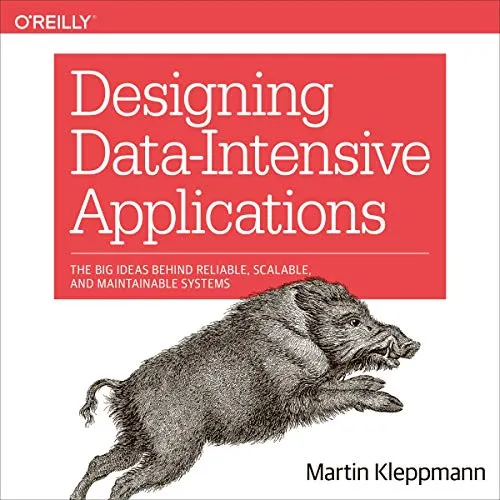
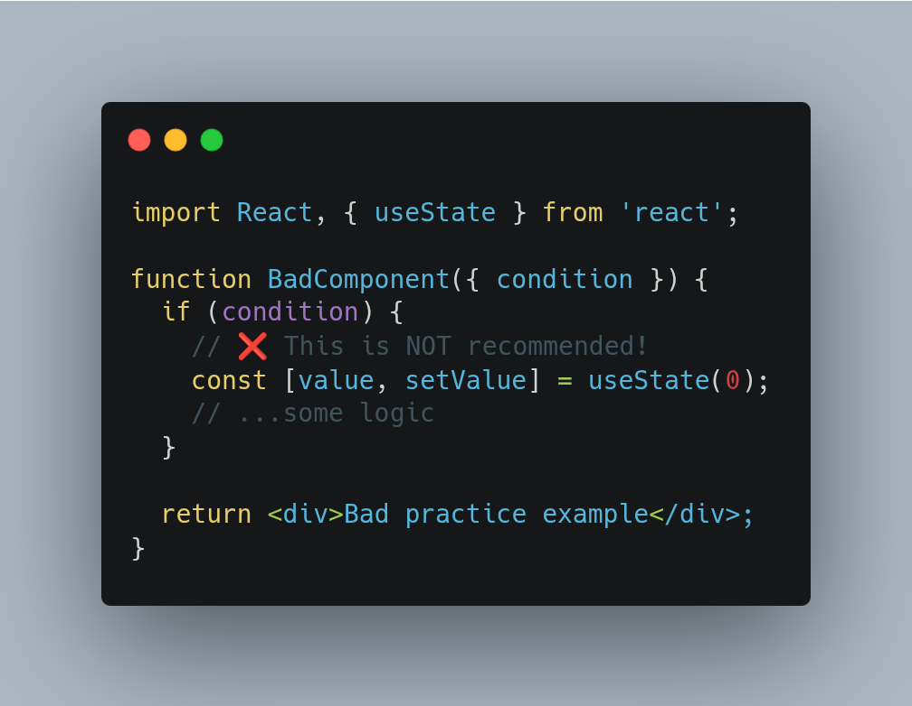
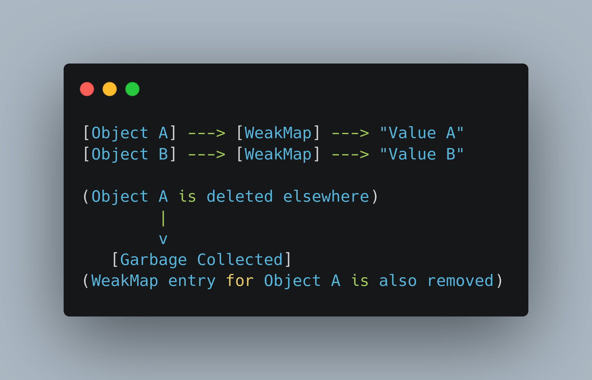

# 💡 Why Public Tinkering

I share my technical learning publicly to deepen my understanding, help others, and connect with the community. Public learning invites feedback, collaboration, and faster growth for everyone involved.

### TypeORM's "DISTINCT pagination" bug

It's not really a single bug — it's a structural problem in TypeORM's `SelectQueryBuilder` that surfaces as **several different runtime errors** depending on your exact combination of `skip` / `take` / `leftJoinAndSelect` / `orderBy`. The most common variant is:

```
TypeError: Cannot read properties of undefined (reading 'databaseName')
    at .../typeorm/query-builder/src/query-builder/SelectQueryBuilder.ts:3748
```

## What you're actually telling TypeORM to do

```ts
repo
  .createQueryBuilder("a")
  .leftJoinAndSelect("a.vehicle", "vehicle") // join + hydrate relation
  .where("a.driverId = :id", { id })
  .orderBy("a.assignedFrom", "DESC")
  .skip(0)
  .take(10)
  .getManyAndCount();
```

Looks innocent. Conceptually you want: "give me the 10 most recent assignments for this driver, with their vehicle joined."

## What TypeORM is forced to do under the hood

`skip` and `take` are **not** the same as raw SQL `OFFSET` / `LIMIT`. They mean **"paginate over distinct entities, regardless of join cardinality"**. If you have a one-to-many join, the joined rows duplicate the parent — so applying `LIMIT 10` directly to the joined query would cut you off at 10 _rows_, not 10 entities.

To honor that semantic, TypeORM rewrites your query into **two queries**:

1. **The "ids query"** — a `SELECT DISTINCT a.id FROM … ORDER BY … OFFSET … LIMIT …` over a subquery, picking the 10 distinct primary keys.
2. **The "main query"** — `SELECT … FROM … WHERE a.id IN (<those 10>) … ORDER BY …` to load full entities + joined relations.

That works fine when everything you put in `ORDER BY` is a column TypeORM can identify in entity metadata. The ids query needs to:

- Add every ORDER BY column to the SELECT list (Postgres requires `SELECT DISTINCT … ORDER BY x` to include `x` in the projection — otherwise: _"for SELECT DISTINCT, ORDER BY expressions must appear in select list"_).
- Re-alias every column under a synthetic `distinctAlias` outer subquery.
- Look up `databaseName`, `propertyPath`, etc. from entity metadata for each one.

## Where it breaks

That metadata lookup is fragile. Three failure modes show up routinely.

### 1. Raw quoted columns in `orderBy`

```ts
.orderBy('a."assignedFrom"', "DESC") // raw expression, not a property
```

TypeORM can't resolve `a."assignedFrom"` to a column metadata object. The DISTINCT rewrite pretends it's a synthetic expression and emits SQL like `SELECT DISTINCT … ORDER BY a_assignedFrom`, where `a_assignedFrom` is missing from the projection. Postgres errors with the _"ORDER BY expressions must appear in select list"_ message.

### 2. `leftJoinAndSelect` + `skip/take` + multi-column ordering — the `databaseName` crash

```ts
.leftJoinAndSelect("a.vehicle", "vehicle")
.orderBy("a.assignedFrom", "DESC")
.skip(0).take(10)
.getManyAndCount();
```

TypeORM walks the join tree to figure out which columns to carry into the distinct subquery. For a relation that has nullable joined columns, or for ORDER BY expressions referencing joined-but-not-fully-resolvable columns, it can hit a code path where the metadata for one of the ORDER BY entries comes back `undefined`. It then does `metadata.databaseName` on it and the whole request crashes:

```
TypeError: Cannot read properties of undefined (reading 'databaseName')
    at SelectQueryBuilder.ts:3748
```

This is independent of how the ORDER BY column is spelled — it bites even when you do everything "right".

### 3. Wrong total count

Even when it doesn't crash, `getManyAndCount` with joins gives **inflated totals**. The count query joins everything and counts the joined rows, not the distinct entities. So you get `total: 23` while you only have 10 underlying records — and your pagination breaks.

## The proper fix — `findAndCount`

`findAndCount` and the rest of the `Repository.find*` family use a **completely different code path**. Internally they:

- Run the count query against the **bare entity table only**, no joins → correct total.
- Run a paginated SELECT against the bare entity table → correct page of entity ids.
- Then load the requested relations as **secondary queries** using `IN (<page ids>)` — the so-called "relation loaders" — and stitch the result objects together in JS.

No DISTINCT subquery, no `databaseName` metadata trip, no inflated counts. Trade-off: it's `1 + N_relations` queries instead of one big join. For pagination that's almost always what you want — pages are small, the join would have been hydrated into JS objects anyway.

### Before

```ts
async findHistoryByDriver(driverId: string, query: AssignmentQueryDto) {
  return this.paginate(query, (qb) =>
    qb
      .where('a."driverId" = :driverId', { driverId })
      .leftJoinAndSelect("a.vehicle", "vehicle"),
  );
}

private async paginate(query, apply) {
  const page = query.page ?? 1;
  const limit = query.limit ?? 20;

  const qb = this.repo
    .createQueryBuilder("a")
    .orderBy('a."assignedFrom"', "DESC");

  apply(qb);

  const [data, total] = await qb
    .skip((page - 1) * limit)
    .take(limit)
    .getManyAndCount(); // 💥 boom

  return { data, total, page, limit, totalPages: Math.ceil(total / limit) };
}
```

### After

```ts
async findHistoryByDriver(driverId: string, query: AssignmentQueryDto) {
  return this.paginate(query, { driverId }, { vehicle: true });
}

private async paginate(
  query: AssignmentQueryDto,
  where: FindOptionsWhere<VehicleDriverAssignment>,
  relations: FindOptionsRelations<VehicleDriverAssignment>,
) {
  const page = query.page ?? 1;
  const limit = query.limit ?? 20;

  const [data, total] = await this.repo.findAndCount({
    where,
    relations,
    order: { assignedFrom: "DESC" },
    skip: (page - 1) * limit,
    take: limit,
  });

  return { data, total, page, limit, totalPages: Math.ceil(total / limit) };
}
```

## Rules of thumb

1. **Need pagination + relations? Use `findAndCount` + `relations: { … }`.** Not `createQueryBuilder` with `leftJoinAndSelect` + `skip/take`.
2. **Use `createQueryBuilder` only when you need things `find*` can't express:** sub-selects, raw aggregates, `loadRelationCountAndMap`, computed columns, `FOR UPDATE`, dynamic search ILIKE chains, etc.
3. **If you must paginate over a QB with joins**, either:
   - run the count query separately against the bare table, then a joined query for the page, or
   - use `qb.distinct(true)` and put the order-by column in a select expression.
4. **Always reference entity properties in `orderBy`/`where`** (`'a.assignedFrom'`), never raw quoted columns (`'a."assignedFrom"'`). The latter only matters when you really need a SQL expression Postgres-side, like `LOWER("name")` or a `COALESCE`.

## Why it's still around in 2026

This has been reported many times — `Cannot read properties of undefined (reading 'databaseName')` is a recurring failure mode the maintainers see. The relevant tickets cluster around:

- `getManyAndCount` returning inflated totals with joins (open since 2018).
- DISTINCT-subquery generation crashing on a subset of `orderBy` shapes.
- The general recommendation in the docs (since ~v0.3) to prefer `find*` for "list with relations" use cases.

The practical takeaway: **in TypeORM, `findAndCount` is the workhorse for paginated list endpoints.** Reach for `createQueryBuilder` only when you genuinely need its extra power — and when you do, be wary of the `skip/take` + `leftJoinAndSelect` interaction.

### Hyrum's Law

https://www.hyrumslaw.com

### pgAudit Use Case: Financial Compliance Auditing

Scenario: A bank needs to track all changes to customer account balances for regulatory compliance (SOX, PCI-DSS) and fraud detection.

```
- Who changed account #12345 balance from $10,000 → $9,800?
- What SQL was executed? 
- When exactly? From which IP?
- Was it SELECT, UPDATE, or mass DELETE?
```

Standard PostgreSQL logs lack structured audit trails for forensics.

Solution: pgAudit

```
LOG: AUDIT: SESSION,47,1,READ,SELECT,TABLE,public.accounts,"SELECT balance FROM accounts WHERE id = 12345",2026-02-28 15:17:23 CET,user123@10.0.2.15(5432)

LOG: AUDIT: SESSION,48,1,WRITE,UPDATE,TABLE,public.accounts,"UPDATE accounts SET balance = balance - 200 WHERE id = 12345",2026-02-28 15:17:45 CET,suspicious_user@203.0.113.5(5432)

LOG: AUDIT: SESSION,49,1,DDL,CREATE TABLE,TABLE,public.suspicious_transfers,"CREATE TABLE suspicious_transfers AS SELECT * FROM accounts",2026-02-28 15:18:01 CET,admin@192.168.1.100(5432)
```

pgAudit turns PostgreSQL into a compliance-ready database without trigger overhead or app-layer logging complexity.

### copyOf in Java

```
Map.copyOf() - IMMUTABLE object
Map.copyOf(mappings);  // Thread-safe without synchronize
Map.copyOf() uses System.arraycopy() - native C-speed!
```

### IoC - Coupling and Cohesion

> Dependency inversion control is a natural way to avoid tight coupling because we relay on interface, not inmplementation.

### Designing Data-Intensive Applications



### In React props object are passed as a reference not a value

If the parent mutates an object prop in place, the child sees the change, but React may not re-render if the object reference didn’t change.

That’s why the recommended pattern is to treat props/state as immutable and always create a new object/array when updating, so React sees a new reference and re-renders.

### The Richardson Maturity Model

Simple way to describe how “RESTful” an API really is. It defines four levels (0–3), where each level adds more usage of HTTP semantics and REST principles.

Level 0 – “Swamp of POX”
Everything goes through a single endpoint, usually one HTTP method (often POST). HTTP is used only as a transport tunnel, and the real action is described in the request body.

Level 1 – Resources
The API starts exposing multiple endpoints representing resources, like /users or /orders/123. However, it may still overuse a single HTTP method and not leverage HTTP fully.

Level 2 – HTTP Verbs & Status Codes
Resources are combined with proper use of HTTP methods: GET for reading, POST for creating, PUT/PATCH for updating, DELETE for removing, plus meaningful status codes. This is where most practical “REST APIs” end up.

Level 3 – Hypermedia (HATEOAS)
On top of Level 2, responses include links and hypermedia controls that tell the client what it can do next. The client discovers navigation and actions dynamically, similar to how a human browses web pages.

In practice, aiming for Level 2 gives a clean, predictable API that fits well with HTTP. Level 3 is more advanced and rarely fully implemented, but it’s useful as a target when designing truly RESTful systems.

# Optimistic locking

Concurrency control technique where transactions proceed without locking resources, assuming conflicts are rare, and validation is done before commit. If a conflict is detected (another transaction modified the data first), the transaction is rolled back and typically retried, thus allowing higher concurrency and better throughput in environments with low contention.

```
@Entity
public class Product {

    @Id
    private Long id;

    private String name;

    // Version field for optimistic locking
    @Version
    private Long version;

    // getters and setters
}
```

# useTransition > useState

`useState` for loading is like hard-coding a traffic light for every car. useTransition says:

> “Let React’s traffic system handle it.”

```
// old version
const [loading, setLoading] = useState(false);

const handleFetch = async (id) => {
  setLoading(true);
  await someFetchCall(id);
  setLoading(false);
}

// recommended
const [loading, startLoadingTransition] = useTransition();

const handleFetch = (id) => {
  startLoadingTransition(async () => {
    await someFetchCall(id);
  });
}
```

# Event loop order

The Node.js event loop has six main phases: timers, pending callbacks, idle/prepare, poll, check, and close callbacks. Timers handle setTimeout/setInterval, poll handles most I/O, check runs setImmediate, and microtasks (process.nextTick, Promises) are run between callbacks, giving them higher priority than normal phase callbacks.

```
console.log("A");

setTimeout(() => console.log("B"), 0);

Promise.resolve().then(() => console.log("C"));

(async () => {
 console.log("D");
 await null;
 console.log("E");
})();

console.log("F");
```

🤯 Hint:
Think about the event loop order:

Synchronous 🧩

Microtasks (Promises, await) ⚡

Macrotasks (setTimeout) ⏰

One macrotask execution cycle includes:

- Execute the macrotask.

- Execute all microtasks in the microtask queue (all of them, not just one).

- Then move to the next macrotask.

### Delegate anything possible (like gzip compression, SSL termination) to a reverse proxy instead of handling it directly in Node.js.

Node.js runs on a single thread and is not optimized for CPU-intensive tasks such as compressing responses or terminating SSL connections. Offloading these tasks to specialized infrastructure (e.g., Nginx, HAProxy, or cloud load balancers) frees up your Node.js process to focus purely on application logic and improves overall performance and scalability.

Benefits include:

- Reduced CPU load on your Node.js app.

- Improved response times and throughput.

- Simplified application code.

- Better resource utilization.

This is a best practice for production-ready, high-performance Node.js services and aligns with modern deployment architectures.

### as and : (type assertion vs type annotation)

```
// Define the User type
type User = {
  name: string;
  age: number;
};

// Type annotation using ':'
let data: unknown = '{"name":"Alice","age":30}';

// Type assertion using 'as'
let user = JSON.parse(data as string) as User;

// Now TypeScript knows 'user' is of type User
console.log(`User: ${user.name}, Age: ${user.age}`);
```

### httpOnly

An HttpOnly cookie is a type of cookie in web applications that includes the HttpOnly attribute, which restricts access to the cookie from client-side scripts such as JavaScript. This security feature is crucial for protecting sensitive information—like session tokens or authentication credentials—stored in cookies from attacks such as Cross-Site Scripting (XSS).

## Unmount

```
import React, { useEffect } from 'react';

function MyComponent() {
  useEffect(() => {
    // This code runs when the component mounts

    return () => {
      // This code runs when the component unmounts
      console.log('Component is unmounting!');
      // Call your cleanup function here
    };
  }, []); // Empty dependency array ensures it runs only on mount/unmount

  return <div>Hello!</div>;
}

export default MyComponent;
```

## Virtualization

Virtualization is a widely used performance technique in React for efficiently rendering large lists, tables, or grids. Virtualization (also called windowing) works by only rendering the items that are currently visible in the viewport, plus a small buffer, instead of rendering every item in a large dataset at once. This dramatically reduces the number of DOM nodes, improves rendering speed, lowers memory usage, and results in smoother scrolling and better overall app responsiveness

```
import { FixedSizeList as List } from 'react-window';

const Row = ({ index, style }) => (
  <div style={style}>Row {index}</div>
);

const Example = () => (
  <List
    height={150}
    itemCount={1000}
    itemSize={35}
    width={300}
  >
    {Row}
  </List>
);
```

## If loop and useState



## Hydration

ReactJS hydrates HTML, but what does it mean?

When using server side rendering, the server generates and sends fully rendered HTML to the browser. This allows users to see the content quickly, but initially, this HTML is "static" — it does not respond to user interactions because the JavaScript logic and event handlers are not yet active.

Once the browser loads the necessary JavaScript, React "hydrates" the existing HTML. This means React attaches its event listeners and internal state to the already-rendered DOM nodes, transforming the static page into a fully interactive React application.

Hydration is different from a full client-side render, where React would create the DOM from scratch. Instead, hydration reuses the server-rendered HTML and simply "activates" it with interactivity


## Garbage collector in the browser

Using a `WeakMap` in JavaScript offers several key advantages:

- Automatic Memory Management

- No Manual Cleanup Required: Because entries are automatically removed when the key object becomes unreachable, you don't need to manually delete entries to free up memory.
- Prevents Memory Leaks: Unlike Map, which holds strong references to keys and can keep objects in memory indefinitely, WeakMap allows objects to be garbage collected as soon as they are no longer referenced elsewhere, reducing the risk of unintentional memory retention



Just garbage collector in a web browser ;-)

## IndexedDB vs LocalStorage

IndexedDB - everyone knows LocalStorage but there is better alternative

IndexedDB is ideal for offline mode because it allows web applications to store large amounts of structured data directly in the user's browser, enabling full CRUD operations without an internet connection. This means users can interact with the app and access or modify their data while offline, and any changes can be synchronized with the server once connectivity is restored.


```
let openRequest = indexedDB.open("store", 1);

openRequest.onupgradeneeded = function() {
  // triggers if the client had no database
  // ...perform initialization...
};

openRequest.onerror = function() {
  console.error("Error", openRequest.error);
};

openRequest.onsuccess = function() {
  let db = openRequest.result;
  // continue working with database using db object
};
```
### References

https://javascript.info/indexeddb

https://dexie.org/
